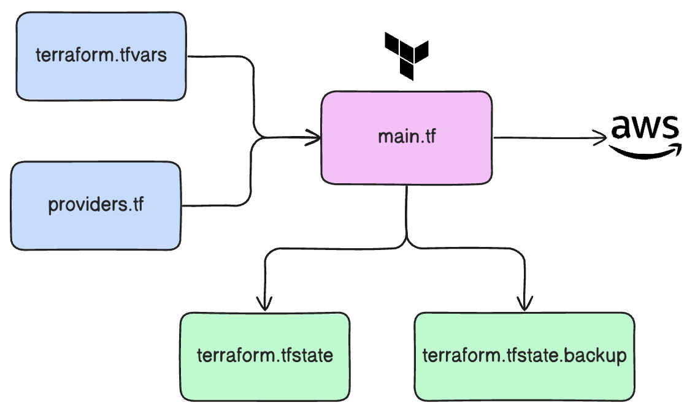

# Provisioning AWS Resources using Terraform

This repository contains Terraform configuration files for provisioning AWS resources as part of an Infrastructure as Code (IaC) setup. The project provisions foundational AWS infrastructure, including a VPC, EC2 instance, subnet, and associated network components, using HashiCorp Terraform.

---

## Table of Contents
1. [Project Overview](#project-overview)
2. [Prerequisites](#prerequisites)
3. [Files in the Repository](#files-in-the-repository)
4. [Resources Created](#resources-created)
5. [How to Use](#how-to-use)
6. [High-Level Architecture](#high-level-architecture)
7. [Outputs](#outputs)
8. [Security and Best Practices](#security-and-best-practices)

---

## Project Overview
This project demonstrates how to use Terraform to automate the provisioning of the following AWS resources:
- Virtual Private Cloud (VPC)
- Subnet
- Internet Gateway (IGW)
- Route Table and Route Table Association
- Security Group
- EC2 Instance

The EC2 instance is pre-configured to host an NGINX server using a startup script that installs and runs Docker.

## Prerequisites
To deploy this infrastructure, ensure you have the following:
1. **Terraform:** Installed on your local machine ([Installation Guide](https://developer.hashicorp.com/terraform/tutorials/aws-get-started/install-cli)).
2. **AWS CLI:** Configured with the necessary IAM permissions to provision resources.
3. **AWS Account:** With programmatic access enabled.
4. **SSH Key Pair:** A key pair must exist, or you should specify the public key file location in `terraform.tfvars`.

## Files in the Repository
- **`main.tf`:** Defines the AWS resources and their interconnections.
- **`providers.tf`:** Specifies the required AWS provider and its version.
- **`start-script.sh`:** A startup script executed on the EC2 instance to install Docker and run an NGINX container.
- **`terraform.tfvars`:** Contains input variable values (user-supplied).
- **`variables.tf`:** Declares input variables for the Terraform configuration.
- **`output.json`:** Captures and stores the output values after resource creation.

## Resources Created
The Terraform script provisions the following AWS resources:

1. **VPC:** A custom Virtual Private Cloud to host the infrastructure.
2. **Subnet:** A public subnet within the VPC.
3. **Internet Gateway:** Enables internet connectivity for resources within the VPC.
4. **Route Table:** Configures routing for the subnet to access the internet.
5. **Route Table Association:** Associates the route table with the public subnet.
6. **Security Group:** Configures firewall rules for the EC2 instance, allowing SSH (port 22) and HTTP (port 8080) traffic.
7. **EC2 Instance:** A t2.micro instance running an NGINX server in a Docker container.
8. **AMI Data Source:** Retrieves the latest Amazon Linux 2 AMI.

## How to Use
### Step 1: Clone the Repository
```bash
git clone https://github.com/YashwanthKothakota9/aws-ec2-terraform
cd aws-ec2-terraform
```

### Step 2: Configure Input Variables
Update `terraform.tfvars` with appropriate values:
```hcl
vpc_cidr_block       = "10.0.0.0/16"
subnet_cidr_block    = "10.0.1.0/24"
avail_zone           = "us-east-1a"
env_prefix           = "myapp"
my_ip                = "<your-public-ip>/32"
instance_type        = "t2.micro"
public_key_location  = "~/.ssh/id_rsa.pub"
```

### Step 3: Initialize Terraform
Run the following command to initialize the Terraform workspace:
```bash
terraform init
```

### Step 4: Validate the Configuration
Ensure the configuration is valid:
```bash
terraform validate
```

### Step 5: Apply the Configuration
Run the following command to provision the resources:
```bash
terraform apply
```
Review the plan and confirm by typing `yes`.

### Step 6: Verify the Deployment
Once the deployment is complete, access the public IP of the EC2 instance to verify NGINX is running:
```bash
http://<public-ip>:8080
```

### Step 7: Destroy Resources (Optional)
To clean up resources, run:
```bash
terraform destroy
```

## High-Level Architecture
The following diagram illustrates the architecture provisioned by the Terraform script:



## Outputs
The configuration provides the following outputs:
- **AMI ID:** The ID of the Amazon Linux 2 AMI used for the EC2 instance.
- **Public IP:** The public IP address of the EC2 instance.

To view outputs, run:
```bash
terraform output
```

## Security and Best Practices
1. **IAM Roles:** Ensure the AWS CLI profile used has minimal required permissions.
2. **Secure SSH:** Restrict access to port 22 to your specific IP address.
3. **Resource Limits:** Use tags to manage resource visibility and cost.
4. **Version Control:** Use versioned state files and a remote backend for collaboration.

---

This project demonstrates how Terraform can streamline the provisioning and management of AWS infrastructure, enabling repeatable and consistent deployments.

